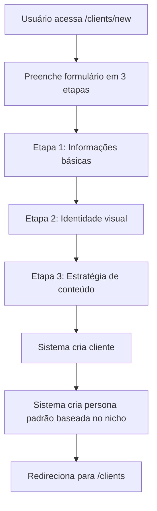

# Performance Social Media - Documentação Técnica

## Visão Geral

O **Performance Social Media** é uma plataforma SaaS para gestão de múltiplos clientes e geração automatizada de conteúdo estratégico para Instagram, com IA customizável por perfil.

---

## Arquitetura do Sistema

### Stack Tecnológica

| Componente | Tecnologia |
|------------|------------|
| Frontend | Next.js 16.2.4, React 19.2.4, TypeScript 5 |
| Estilização | Tailwind CSS 4, CSS Modules |
| Animações | Framer Motion 12.38.0 |
| Ícones | Lucide React |
| Backend | Next.js API Routes |
| Banco de Dados | Supabase (PostgreSQL) |
| Autenticação | Supabase Auth |
| IA | Google Gemini Flash, OpenAI GPT-4o (fallback) |
| Deploy | Vercel |

---

## Estrutura de Diretórios

```
src/
├── app/                          # Rotas do Next.js App Router
│   ├── (auth)/                   # Grupo de rotas de autenticação
│   │   ├── forgot-password/
│   │   ├── login/
│   │   └── reset-password/
│   ├── admin/
│   │   └── page.tsx              # Painel administrativo
│   ├── api/                      # API Routes
│   │   ├── backlog/
│   │   │   └── generate/         # Gera conteúdo do backlog
│   │   ├── calendar/
│   │   │   └── generate/         # Gera calendário editorial
│   │   ├── chat/
│   │   │   └── route.ts          # Chat com IA
│   │   ├── generate/
│   │   │   └── route.ts          # Geração de cronograma (legado)
│   │   └── image/
│   │       └── route.ts          # Geração de imagens DALL-E
│   ├── backlog/
│   │   └── page.tsx              # Gestão de posts pendentes
│   ├── clients/
│   │   ├── new/
│   │   │   └── page.tsx          # Cadastro de cliente
│   │   └── page.tsx              # Listagem de clientes
│   ├── components/               # Componentes compartilhados
│   │   ├── ChatPanel.tsx         # Painel de chat IA
│   │   └── ClientSelector.tsx    # Seletor de cliente ativo
│   ├── globals.css               # Estilos globais
│   ├── layout.tsx                # Layout raiz com providers
│   └── page.tsx                  # Dashboard principal
├── lib/                          # Utilitários e configurações
│   ├── ai/                       # Sistema de IA
│   │   ├── personas.ts           # Gerenciamento de personas
│   │   └── service.ts            # Serviços de IA
│   ├── auth-context.tsx          # Contexto de autenticação
│   ├── client-context.tsx        # Contexto de clientes
│   └── supabase.ts               # Configuração Supabase
├── types/                        # Tipos TypeScript
│   ├── calendar.ts               # Tipos de calendário
│   ├── client.ts                 # Tipos de cliente
│   └── content.ts                # Tipos de conteúdo
└── public/                       # Assets estáticos

supabase/
└── migrations/
    └── 001_multi_client_schema.sql  # Schema do banco
```

---

## Modelo de Dados

### Tabela: `clients`
Armazena os clientes de cada usuário.

| Campo | Tipo | Descrição |
|-------|------|-----------|
| id | UUID | Chave primária |
| user_id | UUID | Referência ao usuário (auth.users) |
| name | TEXT | Nome do cliente |
| instagram_handle | TEXT | @ do Instagram |
| niche | TEXT | Nicho/segmento |
| brand_colors | JSONB | {primary, secondary, accent} |
| logo_url | TEXT | URL do logo |
| voice_tone | TEXT | Tom de voz |
| target_audience | TEXT | Descrição do público-alvo |
| content_pillars | JSONB | Array de pilares de conteúdo |
| created_at | TIMESTAMPTZ | Data de criação |
| updated_at | TIMESTAMPTZ | Data de atualização |

### Tabela: `ai_personas`
Personas de IA customizadas por cliente.

| Campo | Tipo | Descrição |
|-------|------|-----------|
| id | UUID | Chave primária |
| client_id | UUID | Referência ao cliente |
| system_prompt | TEXT | Prompt de sistema da IA |
| niche_expertise | TEXT | Especialidade do nicho |
| examples | JSONB | Exemplos de bom/mau conteúdo |
| model_preference | TEXT | 'gemini' ou 'openai' |
| temperature | DECIMAL | Criatividade (0-1) |
| max_tokens | INTEGER | Limite de tokens |

### Tabela: `content_calendar`
Itens do calendário editorial.

| Campo | Tipo | Descrição |
|-------|------|-----------|
| id | UUID | Chave primária |
| client_id | UUID | Referência ao cliente |
| content_type | ENUM | Tipo: feed_static, feed_carousel, feed_reel, story_* |
| funnel_stage | ENUM | Estágio: atencao, interesse, desejo, acao |
| title | TEXT | Título do conteúdo |
| copy | TEXT | Texto da legenda |
| hashtags | TEXT | Hashtags |
| visual_prompt | TEXT | Prompt para geração de imagem |
| image_url | TEXT | URL da imagem gerada |
| scheduled_date | DATE | Data agendada |
| scheduled_time | TIME | Horário agendado |
| status | ENUM | rascunho, agendado, publicado, arquivado |
| order | INTEGER | Ordem do dia |

### Tabela: `backlog_items`
Posts pendentes/backlog.

| Campo | Tipo | Descrição |
|-------|------|-----------|
| id | UUID | Chave primária |
| client_id | UUID | Referência ao cliente |
| title | TEXT | Título/tema |
| description | TEXT | Descrição detalhada |
| suggested_funnel_stage | ENUM | Estágio sugerido do funil |
| suggested_content_type | ENUM | Tipo sugerido de conteúdo |
| priority | ENUM | baixa, media, alta, urgente |
| status | ENUM | pendente, em_producao, pronto, agendado |
| theme_ideas | JSONB | Ideias de temas |
| reference_links | JSONB | Links de referência |
| scheduled_date | DATE | Data agendada (quando aplicável) |

---

## Sistema de IA

### Personas Customizáveis

Cada cliente pode ter uma persona de IA única, configurada automaticamente baseada no nicho:

**Nichos Suportados:**
- E-commerce
- Serviços
- Educação
- Saúde
- Beleza
- Moda
- Alimentação
- Tecnologia
- Imobiliário
- Fitness
- Outro (genérico)

### Estrutura de Prompts

```
System Prompt (Persona)
    ↓
Contexto do Cliente (nome, nicho, tom, público, pilares)
    ↓
Tarefa Específica (gerar calendário, backlog, etc.)
    ↓
Constraints (frequência, distribuição do funil)
    ↓
Output Format (JSON estruturado)
```

### Fallback de Modelos

1. **Primário:** Google Gemini 1.5 Flash
2. **Secundário:** OpenAI GPT-4o (quando Gemini falha)

---

## Fluxos Principais

### 1. Cadastro de Cliente



### 2. Geração de Calendário Editorial

```mermaid
flowchart TD
    A[Usuário seleciona cliente] --> B[Define frequências]
    B --> C{3 stories/dia<br/>3 reels/semana<br/>2 feeds/semana}
    C --> D[Chama /api/calendar/generate]
    D --> E[Busca persona do cliente]
    E --> F[Gemini gera conteúdo]
    F --> G|Falha| H[Fallback OpenAI]
    G --> I[Parse JSON]
    H --> I
    I --> J[Salva em content_calendar]
    J --> K[Retorna resultado]
```

### 3. Gestão de Backlog (12 Posts Atrasados)

```mermaid
flowchart TD
    A[Usuário acessa /backlog] --> B[Adiciona item: "12 posts sobre X"]
    B --> C[Define prioridade: urgente/alta/media/baixa]
    C --> D[Item salvo com status: pendente]
    D --> E[Usuário clica "Gerar"]
    E --> F[Chama /api/backlog/generate]
    F --> G[IA gera múltiplos formatos]
    G --> H[Salva no calendário]
    H --> I[Atualiza status para: pronto]
```

### 4. Funil de Conteúdo

Distribuição automática em todos os conteúdos gerados:

| Estágio | % | Tipo de Conteúdo |
|---------|---|------------------|
| Atenção | 40% | Educativo, viral, hooks |
| Interesse | 30% | Cases, provas sociais |
| Desejo | 20% | Benefícios, transformação |
| Ação | 10% | CTA direto, promoções |

---

## API Endpoints

### POST /api/calendar/generate

Gera calendário editorial completo para um cliente.

**Request:**
```json
{
  "client_id": "uuid",
  "month": 1,
  "year": 2024,
  "constraints": {
    "stories_per_day": 3,
    "reels_per_week": 3,
    "feeds_per_week": 2,
    "carousels_per_week": 1,
    "funnel_distribution": {
      "atencao": 40,
      "interesse": 30,
      "desejo": 20,
      "acao": 10
    }
  },
  "additionalContext": "Contexto adicional opcional"
}
```

**Response:**
```json
{
  "success": true,
  "data": {
    "schedule": [...],
    "staticPosts": [...],
    "carousels": [...],
    "reels": [...]
  },
  "items_created": 25
}
```

### POST /api/backlog/generate

Gera conteúdo a partir de um item do backlog.

**Request:**
```json
{
  "client_id": "uuid",
  "backlog_id": "uuid"
}
```

**Response:**
```json
{
  "success": true,
  "data": {
    "staticPosts": [...],
    "carousels": [...],
    "reels": [...]
  },
  "calendar_items": [...]
}
```

---

## Configuração de Ambiente

### Variáveis de Ambiente (.env.local)

```bash
# Supabase
NEXT_PUBLIC_SUPABASE_URL=https://seu-projeto.supabase.co
NEXT_PUBLIC_SUPABASE_ANON_KEY=sua-chave-anon

# Google Gemini
GEMINI_API_KEY=sua-chave-gemini

# OpenAI (fallback)
OPENAI_API_KEY=sua-chave-openai
```

### Setup do Banco de Dados

1. Acesse o SQL Editor do Supabase
2. Execute o arquivo: `supabase/migrations/001_multi_client_schema.sql`
3. Verifique se as tabelas foram criadas:
   - `clients`
   - `ai_personas`
   - `content_calendar`
   - `backlog_items`

---

## Componentes Principais

### ClientSelector

Dropdown para troca de contexto entre clientes. Persiste seleção no localStorage.

```tsx
<ClientSelector />
```

### useClient Hook

Hook para acessar o contexto de clientes:

```tsx
const { 
  clients,           // Lista de clientes
  activeClient,      // Cliente atualmente selecionado
  setActiveClient,   // Função para trocar cliente
  loading,           // Estado de carregamento
  refreshClients,    // Recarrega lista
  createClient,      // Cria novo cliente
  updateClient,      // Atualiza cliente
  deleteClient       // Remove cliente
} = useClient();
```

### Serviços de IA

```tsx
// Gerar calendário
import { generateEditorialCalendar } from '@/lib/ai/service';

const result = await generateEditorialCalendar({
  client,
  constraints: DEFAULT_CONSTRAINTS,
  month: 1,
  year: 2024
});

// Gerar do backlog
import { generateBacklogContent } from '@/lib/ai/service';

const result = await generateBacklogContent({
  client,
  backlogTitle: "12 posts sobre produto X",
  description: "Focar em benefícios"
});
```

---

## Tipos de Conteúdo

### Formatos Suportados

| Tipo | Descrição | Dimensões |
|------|-----------|-----------|
| feed_static | Post estático feed | 1080x1080 |
| feed_carousel | Carrossel | 1080x1350 |
| feed_reel | Reel/Vídeo | 1080x1920 |
| story_single | Story único | 1080x1920 |
| story_sequence | Sequência de stories | 1080x1920 |
| story_poll | Enquete | 1080x1920 |
| story_question | Caixa de perguntas | 1080x1920 |
| story_quiz | Quiz | 1080x1920 |

### Estágios do Funil

```typescript
enum FunnelStage {
  ATENCAO = 'atencao',     // Topo - Conteúdo viral/educativo
  INTERESSE = 'interesse', // Meio - Cases/provas sociais
  DESEJO = 'desejo',       // Fundo - Transformação/benefícios
  ACAO = 'acao'            // Conversão - CTA/promoções
}
```

---

## Deploy

### Vercel (Recomendado)

1. Conecte o repositório GitHub ao Vercel
2. Configure as variáveis de ambiente
3. O deploy é automático a cada push na branch main

**URL de Produção:** `https://socialmedia-two-lac.vercel.app`

### Build Local

```bash
# Instalar dependências
npm install

# Build de produção
npm run build

# Iniciar servidor
npm start
```

---

## Roadmap Futuro

### Fase 5 - Integrações Avançadas

- [ ] **ElevenLabs API** - Narração de voz para reels
- [ ] **Pinterest API** - Busca de inspirações visuais
- [ ] **Canva API** - Exportação direta de designs
- [ ] **Gemini Nano** - Geração local de imagens

### Melhorias Planejadas

- [ ] Drag-and-drop no calendário
- [ ] Analytics de performance por post
- [ ] Agendamento automático (Meta API)
- [ ] Templates visuais customizáveis
- [ ] Colaboração em equipe (múltiplos usuários por cliente)

---

## Troubleshooting

### Erro: "Cliente não encontrado"
- Verifique se o `client_id` está correto
- Confirme que o usuário tem permissão (RLS)

### Erro: "Gemini falhou"
- Sistema usa fallback automático para OpenAI
- Verifique se `OPENAI_API_KEY` está configurada

### Erro: "Supabase não configurado"
- Adicione as variáveis `NEXT_PUBLIC_SUPABASE_URL` e `NEXT_PUBLIC_SUPABASE_ANON_KEY`

### Build falha
- Verifique se todos os imports do `lucide-react` existem
- Alguns ícones podem não estar disponíveis (ex: Instagram → use AtSign)

---

## Contribuição

1. Fork o repositório
2. Crie uma branch: `git checkout -b feature/nova-feature`
3. Commit: `git commit -m 'feat: adiciona nova feature'`
4. Push: `git push origin feature/nova-feature`
5. Abra um Pull Request

---

## Licença

Proprietário - Performance Digital

---

**Última atualização:** 23/04/2026
**Versão:** 0.2.0
**Autor:** Performance Digital Team
